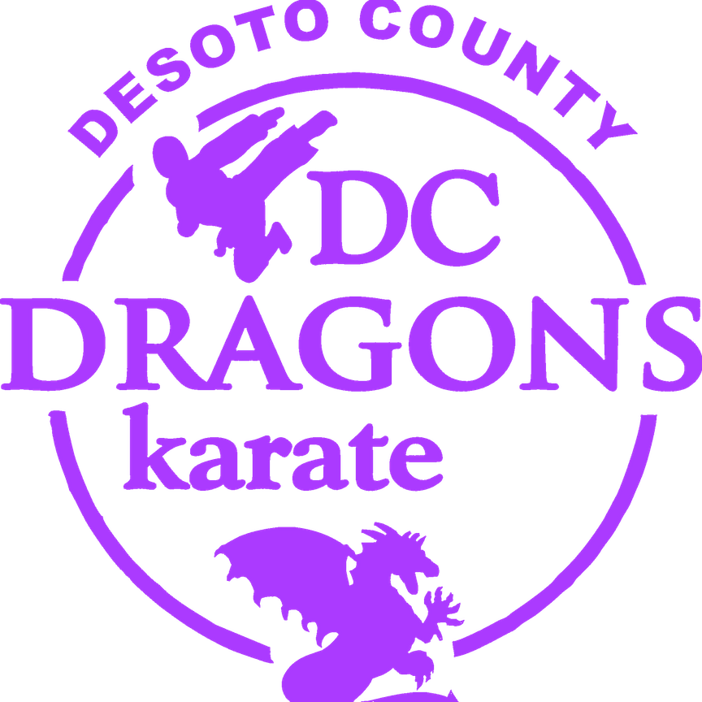

# DC Dragons Karate Website



This repository contains the source code for the [DC Dragons Karate](https://www.dcdragonskarate.com) official website.

## 🥋 About

DC Dragons Karate is a martial arts school located in Olive Branch, MS. This website serves as our digital dojo, providing information about our classes, instructors, philosophy, and allowing new students to get in touch.

## 🚀 Tech Stack

This project is built using:

- [React](https://reactjs.org/) - UI library
- [Vite](https://vitejs.dev/) - Build tool and development server
- [TailwindCSS](https://tailwindcss.com/) - CSS Framework
- [DaisyUI](https://daisyui.com/) - CSS Styling plugin for Tailwind
- [FontAwesome Icons](https://fontawesome.com/icons] - Icon package 
- [CSS Modules](https://github.com/css-modules/css-modules) - For component-scoped styling

## 🛠️ Development

### Prerequisites

- Node.js (v16+)
- npm

### Getting Started

1. Clone the repository
   ```bash
   git clone https://github.com/johncanthony/dcdragonswebsite_react.git
   cd dcdragonskarate
   ```

2. Install dependencies
   ```bash
   npm install
   ```

3. Start the development server
   ```bash
   npm run dev
   ```

4. Open your browser and visit `http://localhost:5173`

### Build for Production

```bash
npm run build
```

The built files will be in the `dist` directory.

## 📂 Project Structure

```
dcdragonskarate/
├── public/             # Static assets
├── src/
│   ├── assets/         # Images, fonts, etc.
│   ├── components/     # Reusable components
│   ├── App.jsx         # Main app component
│   ├── main.jsx        # Entry point
│   └── ...
├── index.html          # HTML template
├── vite.config.js      # Vite configuration
└── package.json        # Project dependencies and scripts
```


